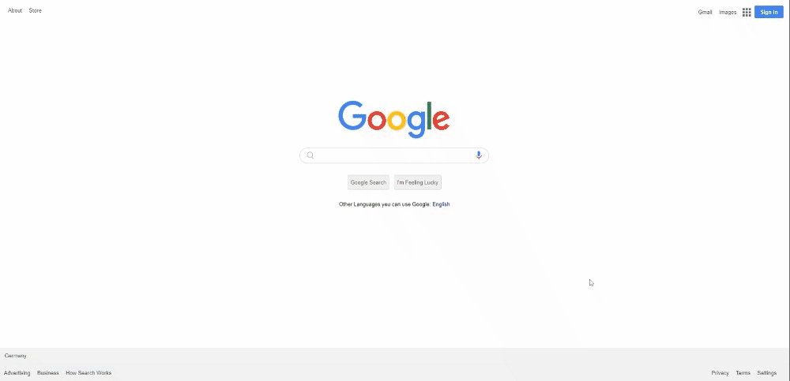

# Google Landing Page Design

<h3>visit: https://aokmen.github.io/Google_Landing_Page</h3>

# Description:
***
* The given code is the HTML and CSS code for a Google homepage clone. The HTML code has a header, main and footer section. The header section contains two unordered lists for navigation links. The main section contains the Google logo, search bar, and search buttons. The footer section contains two unordered lists for footer links.
***
* The CSS code defines the styles for the different elements of the Google homepage clone. It sets the margin, padding, font, and color properties of the elements. It also defines the styles for the navigation links, search bar, and buttons. It also adds hover effects for some elements and sets the background colors and border-radius of the buttons.
